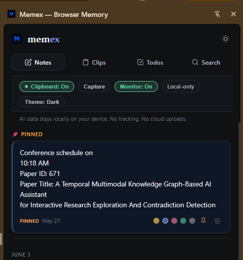
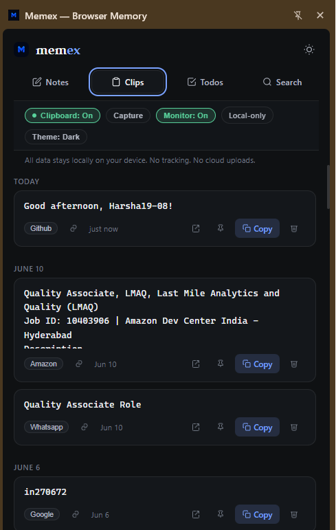
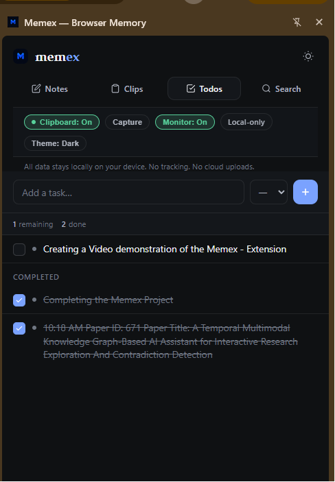
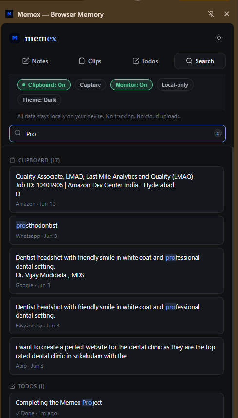
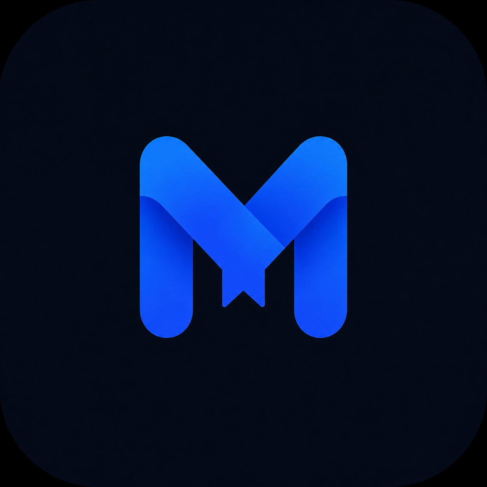

<div align="center">

<!-- Replace with your actual banner image -->
<!--  -->

<br/>


<br/><br/>

# memex

### RAM for human thoughts — while you browse.

<br/>

[](https://chromewebstore.google.com)
[](https://developer.chrome.com/docs/extensions/mv3/intro/)
[](./LICENSE)
[](#)

<br/>

<!-- Replace with your actual demo video thumbnail -->
<!-- [](https://youtu.be/your-link) -->

<br/>

</div>

---

<br/>

> **Memex** is a minimalist Chrome side panel extension for developers and content creators.
> One shortcut. Four tabs. Everything you capture — **instantly saved, forever searchable.**
> No accounts. No cloud. No clutter. Just your brain, extended.

<br/>

---

<br/>

## ✦ Why Memex?

Every developer knows this: you copy a command, write a quick thought, jot a task — and five minutes later it's **gone**. Lost to a closed tab, an overwritten clipboard, a forgotten note.

Memex lives in your browser's side panel, always one shortcut away. It quietly captures what you copy, keeps your notes alive, and tracks your todos — **without ever getting in your way.**

<br/>

---

<br/>

## 🖼 Screenshots

<br/>

| Notes | Clipboard | Todos | Search |
|--------|------------|--------|--------|
|  |  |  |  |

<br/>
<!--
<p align="center">
  
  
</p>
<p align="center">
  
  
</p>
-->


<br/>

## ⚡ Features

<br/>

### 📝 &nbsp;Notes — Instant Sticky Notes

Write anything the moment it appears in your head. Notes are **color-coded, pinned, date-grouped**, and auto-saved as you type. No save button. No friction.

- 5 color themes: yellow, blue, pink, green, gray
- Pin important notes to the top
- Auto-organized by date (Today · Yesterday · May 24…)
- Inline editing — just click and type
- Right-click any webpage text → **"Save to Memex Notes"**

<br/>

### 📋 &nbsp;Clipboard — Never Lose a Copy Again

Every time you hit `Ctrl+C` on any webpage, Memex silently captures it — with the **source domain and timestamp**. Your clipboard becomes a searchable history.

```
npm install @anthropic-ai/sdk
↳ Copied from: docs.anthropic.com · 2 mins ago
```

- Auto-captures on every copy across all sites
- Shows source website for every entry
- Pin the clips you always need
- One-click copy again
- Supports URLs, code, commands, and prose

<br/>

### ✅ &nbsp;Todos — Lightweight Task Tracking

Not a project manager. Not a Kanban board. Just a **clean, fast task list** that stays out of your way.

- Add tasks in under 2 seconds
- Priority levels: 🔴 High · 🟡 Medium · 🟢 Low
- Tap to complete with a satisfying animation
- Remaining vs. done counter always visible

<br/>

### 🔍 &nbsp;Search — One Search, Everything

Type anything. Memex searches your **notes, clipboard history, and todos simultaneously** — and highlights every match.

```
Search: "docker"

→ Notes       docker run -p 3000:3000 -v $(pwd):/app...
→ Clipboard   docker-compose up --build    (github.com)
→ Todos       Fix docker networking issue
```

<br/>

---

<br/>

## 🎬 Demo

<br/>

<!-- Replace with your actual video embed or GIF -->
<!-- Option 1: GIF -->
<!--  -->

<!-- Option 2: YouTube embed (linked image) -->
[](https://youtu.be/GZfD2LT2ylk)

*Demo video / GIF coming soon.*

<br/>

---

<br/>

## ⌨️ Keyboard Shortcuts

| Action | Windows / Linux | macOS |
|--------|----------------|-------|
| Open Notes | `Ctrl` `Shift` `N` | `⌘` `Shift` `N` |
| Open Clipboard | `Ctrl` `Shift` `C` | `⌘` `Shift` `C` |
| Open Todos | `Ctrl` `Shift` `T` | `⌘` `Shift` `T` |
| New Note (in panel) | Click `+` | Click `+` |
| Add Todo (in panel) | Type → `Enter` | Type → `Return` |
| Save selected text | Right-click → *Save to Memex* | Right-click → *Save to Memex* |

<br/>

---

<br/>

## 🚀 Installation

### From Source (Developer Mode)

```bash
# 1. Clone the repo
git clone https://github.com/your-username/memex-extension.git

# 2. Open Chrome and navigate to
chrome://extensions

# 3. Enable "Developer mode" (toggle in top-right)

# 4. Click "Load unpacked"

# 5. Select the cloned `memex-extension` folder
```

That's it. The Memex icon appears in your toolbar. Click it to open the side panel.

<br/>

> **Tip:** Pin Memex to your toolbar by clicking the 🧩 extensions icon → Pin next to Memex.

<br/>

---

<br/>

## 🏗 Tech Stack

```
Chrome Extension   Manifest V3 · Side Panel API · chrome.storage.local
Frontend           Vanilla JS · CSS Custom Properties · Apple SF Pro font stack
Storage            chrome.storage.local — 100% offline, 100% private
Clipboard          Content script + background service worker
Context Menus      Right-click "Save to Memex Notes"
```

No React. No bundler. No build step. **Open the folder and it works.**

<br/>

---

<br/>

## 🗂 Project Structure

```
memex-extension/
├── manifest.json          # Extension config (MV3)
├── sidepanel.html         # Main UI — all 4 tabs
├── src/
│   ├── background.js      # Service worker: clipboard, context menus, commands
│   └── content.js         # Injected into pages: captures copy events
└── icons/
    ├── icon16.png
    ├── icon32.png
    ├── icon48.png
    ├── icon128.png
    └── icon.svg
```

<br/>

---

<br/>

## 🔒 Privacy

Memex is **completely local.** Nothing leaves your machine.

| Data | Where it lives |
|------|---------------|
| Notes | `chrome.storage.local` |
| Clipboard history | `chrome.storage.local` |
| Todos | `chrome.storage.local` |
| Telemetry | ❌ None |
| Network requests | ❌ Zero |
| Accounts required | ❌ Never |

All data is stored in Chrome's local extension storage on your device. Uninstalling the extension removes everything.

<br/>

---

<br/>

## 🤝 Contributing

Contributions are welcome. Please open an issue first for major changes.

```bash
# Fork the repo, make your changes, then open a PR
git checkout -b feature/your-idea
git commit -m "feat: your idea"
git push origin feature/your-idea
```

<br/>

---

<br/>

## 📄 License

MIT © [Harshavardhan Muddada](https://github.com/your-username)

<br/>

---

<br/>

<div align="center">

**Built for developers who think fast and lose thoughts faster.**

<br/>

*If Memex saved you a thought today — drop a ⭐ on the repo.*

<br/><br/>



<br/>

`mem` + `ex` — *memory extended.*

</div>
